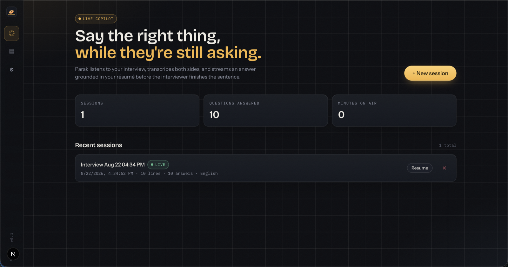
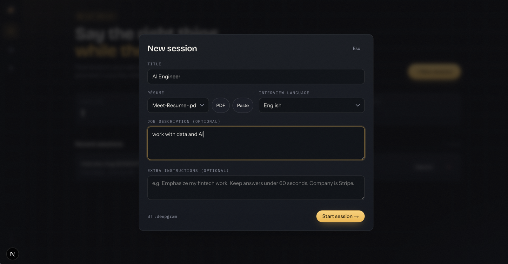
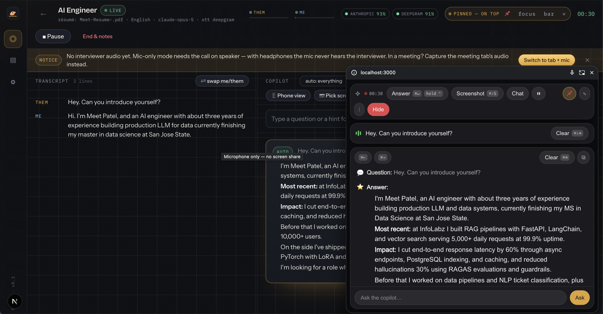

# Parak — live interview copilot

Real-time transcription of your interview (interviewer + you), streamed AI answers grounded in your résumé,
a floating always-on-top answer window, screenshot → coding-problem solver, and structured post-call notes.
Self-hosted, single-user, runs entirely on your laptop — your résumé, transcripts and keys never leave it
except to the AI providers you configure.

Inspired by parakeet-ai.com.



<table>
  <tr>
    <td></td>
    <td></td>
  </tr>
  <tr>
    <td align="center"><sub>New session — résumé, language, job description</sub></td>
    <td align="center"><sub>Live — transcript, streamed answer, floating pinned overlay</sub></td>
  </tr>
</table>

> **Use responsibly.** Some companies prohibit AI assistance in interviews — check the rules that apply to
> you. **Not included on purpose:** anything that hides the app from screen-share or proctoring software.
> The pop-out is a normal OS window; keep it on a second screen, share a single tab/window instead of the
> whole screen, or use the phone view.

## Stack

Next.js 16 (App Router) · TypeScript · Tailwind v4 · SQLite (`better-sqlite3`) ·
Anthropic Claude (`@anthropic-ai/sdk`) or any OpenAI-compatible endpoint ·
Deepgram Nova-3 live STT / OpenAI Realtime / browser Web Speech (zero-key fallback).

## Run

```bash
npm install
cp .env.example .env.local   # optional — keys can also be pasted in Settings
npm run dev                  # http://localhost:3000  (Chrome recommended)
npm run dev:lan              # same, but reachable from your phone on the LAN
```

Keys (env or Settings page): `ANTHROPIC_API_KEY` (best answers), or an OpenAI-compatible key —
several **free** options below. `DEEPGRAM_API_KEY` recommended for transcription (free credits on signup).
Everything you paste in Settings is stored only in the local SQLite DB (`data/`, gitignored).

## How to use

1. **Library** → upload your résumé (PDF/DOCX/TXT/MD) and any documents (project notes, company research).
2. **New session** → pick the résumé, language, paste the job description, add instructions
   ("emphasize fintech", "keep answers under 60s").
3. **Go live** — three capture modes (Settings → Audio source):
   - **mic** *(default, no screen share)* — put the call on speaker; one mic hears both sides and
     **Deepgram diarization splits the voices automatically** (first voice heard = interviewer).
     `⇄ swap me/them` flips every line if it guessed backwards.
   - **tab + mic** — share the meeting tab (Meet / Zoom web / Teams web) with **Share tab audio** ticked.
     Tab audio → `them`, mic → `me`; no diarization needed.
   - **loopback + mic** — interviewer audio from a virtual device (BlackHole / VB-Cable). No screen
     share at all, so sharing your screen with the interviewer is never disturbed.
4. Answers stream in automatically when a question lands — or take control:
   - **Hold ⌃ Control** (~⅓s, adjustable in Settings) → answer *instantly* with everything the
     interviewer just said, even mid-sentence. Works in the main window and the pop-out.
   - `⌘/Ctrl+Enter` same · `⌘/Ctrl+Shift+S` screenshot the shared screen and solve · paste any image ·
     type a question · `⌘/Ctrl+Shift+M` hold auto-answer while you speak · `⌘/Ctrl+Shift+H` hide the pop-out.
5. **Pop-out** — the answers float in a separate always-on-top window (Chrome Document Picture-in-Picture):
   pin it above every app, drag it to any screen, shrink it to a one-line bar, dim it. **📱 Phone view**
   serves the live answers to your phone over the LAN — a different device entirely.
6. **End & notes** → summary, each question + how it went, strengths, improvements, action items,
   and a draft follow-up email.

A usage meter tracks LLM + STT spend per month and per session against your budget.

## Free / alternative LLM providers

Settings → provider **OpenAI-compatible** → pick a preset (base URL + model auto-filled):

| Preset | Cost | Good for |
|---|---|---|
| Groq | free tier, no card | fastest live answers (`llama-4-scout`) |
| Google Gemini | free tier | best quality of the free ones, vision (`gemini-2.5-flash`) |
| NVIDIA NIM | 1000 free credits | `meta/llama-3.3-70b-instruct` |
| OpenRouter | `:free` models | variety |
| Hugging Face | small free credits | slow |
| Ollama | 100% free, offline | `ollama pull llama3.1:8b` (or `qwen2.5vl:7b` for screenshots) |
| OpenAI | paid | `gpt-4.1` |

Env alternative: `OPENAI_API_KEY`, `OPENAI_BASE_URL`, `OPENAI_MODEL`. Screenshot solving needs a
vision-capable model at whichever endpoint you choose.

## Model / latency notes

- Default `claude-opus-5`. **Answer speed** setting: *fast* answers on Sonnet 5 (~0.6s to the first
  word), *best* uses your configured model (~2.5s on Opus). Screenshots and notes always use the
  configured model.
- Résumé + docs sit in a cached system block (`cache_control`), so per-question cost stays small.
- **Answer delay** (silence before auto-answer) and **pause-while-you-speak** are adjustable; the
  hold-Control hotkey skips all waiting.
- Self-echo suppression: you reading an answer out loud is recognized and never answered again.

## Layout

```
src/app/            pages: / (sessions), /library, /settings, /session/[id], /live/[id] (phone view)
src/app/api/        sessions, transcript, answer (SSE), vision (SSE), end (notes), resumes,
                    documents, settings, stt/token, usage, lan
src/lib/server/     db.ts (SQLite), llm.ts (Anthropic + OpenAI-compatible streaming/structured),
                    prompts.ts, extract.ts (PDF/DOCX text), pricing.ts
src/lib/client/     audio.ts (capture), stt.ts (Deepgram/OpenAI/WebSpeech + diarization), echo.ts, sse.ts
src/components/     PopOut (Document PiP), UsageMeter, Shell, Logo
data/parak.db       local database — résumé, transcripts, settings, keys (gitignored)
```

## Not built (yet)

Accounts/billing, mobile layout polish, Electron wrapper for system-wide audio, mock-interview mode.

## License

[MIT](LICENSE)
